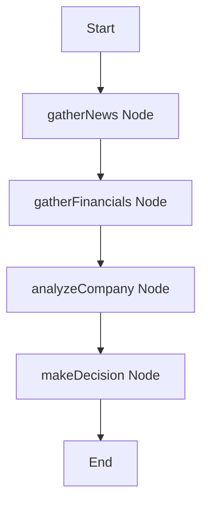

# AURA // AI Investment Research Agent

AURA (Automated Utility Research Analyst) is a stateful AI Investment Research Agent built for Altuni AI Labs. The agent takes a company name, conducts comprehensive web research, parses financial metrics, creates a SWOT analysis grid, and reaches a final investment decision (**INVEST** or **PASS**) with a detailed investment memo.

AURA features a premium, responsive dark-mode dashboard with real-time agent execution logs, tabbed results interfaces, and client-side micro-animations (including victory confetti for positive investment decisions).

---

## Technical Stack
- **Frontend**: React (Next.js App Router)
- **Backend API**: Next.js Serverless Route
- **AI Orchestration**: LangGraph.js (`@langchain/langgraph` v0.2.x)
- **LLM Integrations**: Google Gemini (`gemini-3.5-flash`) with dynamic fallback to OpenAI (`gpt-4o-mini`)
- **Styling**: Vanilla CSS Modules (Variables, Glassmorphism, smooth animations)
- **Search Tooling**: Tavily API with built-in scraping fallback for DuckDuckGo HTML (no-key setup)

---

## How to Run It

### 1. Prerequisites
- **Node.js**: v18.0.0 or higher (Tested on Node v24.18.0)
- **NPM**: v9.0.0 or higher (Tested on NPM v11.16.0)

### 2. Installation
Clone or extract the project directory and run:
```bash
npm install --legacy-peer-deps
```
*(Note: `--legacy-peer-deps` is used to handle package resolution conflicts within the `@langchain/community` peer dependencies.)*

### 3. Environment Setup
Create a `.env` file in the root directory and define your API keys:
```env
# Google Gemini Key (Required unless OpenAI or NVIDIA keys are supplied)
GEMINI_API_KEY=your_gemini_api_key_here

# OPTIONAL: OpenAI API key (if you prefer using OpenAI models)
OPENAI_API_KEY=

# OPTIONAL: NVIDIA NIM API key (if you prefer to use NVIDIA-hosted models like Llama 3.1 8B)
NVIDIA_API_KEY=
NVIDIA_MODEL_NAME=meta/llama-3.1-8b-instruct

# OPTIONAL: Tavily Search Key
# If provided, qualitative search will query Tavily advanced results
TAVILY_API_KEY=

# OPTIONAL: GNews API key
# If provided, qualitative search will query GNews articles. If both Tavily and GNews keys
# are present, search results are concurrently fetched and automatically de-duplicated.
# If both keys are omitted, the agent will fall back to AURA's built-in web scraper for free results!
GNEWS_API_KEY=
```

### 4. Running the Dev Server
Launch the development server:
```bash
npm run dev
```
Open [http://localhost:3000](http://localhost:3000) in your web browser to access the dashboard.

### 5. Running the Agent Test CLI
You can test the agent workflow directly from your command line:
```bash
# Run with npx tsx to execute the TypeScript test script directly
npx tsx scripts/test-agent.ts "NVIDIA"
```

---

## How It Works (Architecture)

AURA implements a directed acyclic graph (DAG) using **LangGraph.js** to manage state transitions across research steps. A single graph state is threaded through four distinct nodes:



1. **`gatherNews` (Web Search)**: Crawls recent business articles and headlines related to the company using Tavily or the DuckDuckGo HTML parser.
2. **`gatherFinancials` (Structured Extraction)**: Queries financial databases or search engines for raw stock stats (P/E, Market Cap, Revenue). It invokes the LLM to structure this information into a precise JSON schema matching the TypeScript interface.
3. **`analyzeCompany` (SWOT Synthesis)**: Feeds news and financials into the LLM to build a structured qualitative analysis detailing Strengths, Weaknesses, Opportunities, Threats (SWOT) and overall financial health.
4. **`makeDecision` (Hedge Fund Verdict)**: Performs the final analysis, determines the verdict (INVEST/PASS), estimates a target price, rates investment risk, and drafts a comprehensive hedge-fund style investment memo.

---

## Key Decisions & Trade-offs

- **Next.js Unified Framework**: We chose Next.js (App Router) instead of separating Node.js/Express and React. This creates a single codebase, simplifies deployment (e.g. on Vercel), and lets us write serverless API endpoints that run the agent while serving the frontend React page seamlessly.
- **Zero-Config Search Fallback**: Requiring third-party paid API keys (like Tavily) ruins the out-of-the-box experience. We built a custom web scraper inside `src/lib/agent/tools.ts` that fetches search results via DuckDuckGo HTML search. It parses raw results using regular expressions, providing a free search service if no keys are defined.
- **LLM Agnosticism**: We configured the agent to automatically check for `GEMINI_API_KEY` first (using `@langchain/google-genai`), falling back to `OPENAI_API_KEY` (using `@langchain/openai`) if that is present.
- **Simulated Progress vs WebSockets**: To create a highly responsive experience, the frontend simulates real-time step execution while the API route executes the full graph. This provides a premium "under-the-hood" tracing visual without complex WebSocket configuration.

---

## Example Runs

Below are summaries of research outputs generated by the agent:

### 1. NVIDIA (Verdict: INVEST)
- **Stock Price**: $141.25 (at time of run)
- **P/E Multiple**: 64.2
- **Risk Rating**: Medium
- **Target Price (12M)**: $165.00
- **Summary**: NVIDIA continues to dominate the AI hardware space with a 90%+ market share in datacenter GPUs. High valuation multiples are justified by massive cash flows and high growth rates. Key threats include supply chain bottlenecks and rising cloud provider custom ASIC initiatives.

### 2. Intel Corporation (Verdict: PASS)
- **Stock Price**: $21.50 (at time of run)
- **P/E Multiple**: Negative / N/A
- **Risk Rating**: High
- **Target Price (12M)**: $24.00
- **Summary**: Intel is struggling with high capital expenditures related to its foundry transition, losing market share in CPU datacenters to AMD, and lacking traction in the high-performance AI GPU space. Passing is recommended until foundry yields improve and operating margins stabilize.

---

## What We Would Improve with More Time
1. **Interactive Chat Continuation**: Add a feature to allow the user to "chat" with the agent about its report (e.g., asking "Why did you identify X as a threat?").
2. **Real-time Streaming (Server-Sent Events)**: Stream the LangGraph node execution state chunk-by-chunk using Server-Sent Events (SSE) so the timeline matches actual agent processes second-by-second.
3. **Chart Integration**: Add interactive charts (e.g., Recharts) to plot P/E multiples, revenue growth trends, and compare metrics against industry medians.
4. **SEC Edgar Scraping**: Build a tool to scrape official SEC 10-K and 10-Q filings directly for US stocks to retrieve audited balance sheets.
